# Architecture — Event Monitor System

## System Architecture Diagram

> Arrow labels show **what travels over each link**, the **trigger mechanism**, and the **protocol**.
> Read left-to-right, top-to-bottom for the happy-path event flow.

```mermaid
flowchart LR
    %% ═══════════════════════════════════════════════════════
    %% 1. EVENT SOURCES
    %% ═══════════════════════════════════════════════════════
    subgraph SOURCES["① Event Sources"]
        direction TB
        SRC_API["🌐 External APIs\nREST clients · SDKs"]
        SRC_WH["🔗 Webhooks\nGitHub · Stripe · PagerDuty"]
        SRC_MAN["🖱️ Manual Triggers\nDashboard · CLI"]
    end

    %% ═══════════════════════════════════════════════════════
    %% 2. API GATEWAY
    %% ═══════════════════════════════════════════════════════
    subgraph APIGW["② API Gateway Layer"]
        direction TB
        GW["AWS API Gateway\nREST API · HTTPS"]
        MW_JWT["JWT Auth\nadmin · operator · viewer"]
        MW_RATE["Rate Limiter\n100 req/min  POST /events\n500 req/min  POST /webhook"]
        MW_VAL["Input Validator\nJoi schemas · XSS · size limits"]
        MW_SEC["Security\nCORS · IP allowlist · headers"]

        GW -->|"decode & verify\nBearer token"| MW_JWT
        MW_JWT -->|"check bucket\ncounter in DynamoDB"| MW_RATE
        MW_RATE -->|"sanitize body\nreject oversized"| MW_VAL
        MW_VAL -->|"attach security\nresponse headers"| MW_SEC
    end

    %% ═══════════════════════════════════════════════════════
    %% 3. LAMBDA — INGESTION
    %% ═══════════════════════════════════════════════════════
    subgraph INGEST["③ Ingestion Lambdas (128 MB)"]
        direction TB
        L_INGEST["eventIngest\nPOST /events\nValidate → assign UUID\nReturn 202 Accepted"]
        L_WEBHOOK["webhookReceiver\nPOST /webhook/{source}\nHMAC-SHA256 signature verify\nNormalize payload → Event schema"]
    end

    %% ═══════════════════════════════════════════════════════
    %% 4. ASYNC QUEUE
    %% ═══════════════════════════════════════════════════════
    subgraph QUEUE["④ Async Queue"]
        direction TB
        SQS["SQS — EventProcessingQueue\nVisibility timeout: 30 s\nMessage retention: 4 days"]
        DLQ["SQS — DeadLetterQueue\nAfter 3 failed receives\nRetention: 14 days · zero data loss"]

        SQS -->|"message fails\n3× receive attempts"| DLQ
    end

    %% ═══════════════════════════════════════════════════════
    %% 5. LAMBDA — PROCESSING
    %% ═══════════════════════════════════════════════════════
    subgraph PROC["⑤ Processing Lambda (256 MB)"]
        L_PROC["eventProcessor\nSQS trigger · batch = 10\nRule engine classification\nConditional write on idempotencyKey"]
    end

    %% ═══════════════════════════════════════════════════════
    %% 6. DYNAMODB
    %% ═══════════════════════════════════════════════════════
    subgraph DYNAMO["⑥ DynamoDB"]
        direction TB
        TBL_EVENTS["EventsTable\nPK: eventId  SK: timestamp\nGSI: severity-index\nGSI: source-index\nStreams: NEW_IMAGE  TTL: 30 d"]
        TBL_ALERTS["AlertsTable\nPK: alertId  SK: timestamp\nstatus: sent · failed · retrying\nretryCount: 0–3"]
        TBL_METRICS["MetricsTable\nPK: metricKey  SK: timestamp\nAI token usage · cost · counters"]
    end

    %% ═══════════════════════════════════════════════════════
    %% 7. LAMBDA — AI ANALYZER
    %% ═══════════════════════════════════════════════════════
    subgraph AIBLOCK["⑦ AI Analysis Lambda (256 MB)"]
        L_ANALYZER["eventAnalyzer\nDynamoDB Streams trigger\nSkips severity=low\nOpenAI gpt-4o-mini\nCircuit breaker: 5 fail → 5 min off"]
    end

    OPENAI["☁️ OpenAI API\ngpt-4o-mini\nexternal HTTPS"]

    %% ═══════════════════════════════════════════════════════
    %% 8. SNS
    %% ═══════════════════════════════════════════════════════
    subgraph SNSBLOCK["⑧ SNS Fan-out"]
        SNS["SNS — CriticalAlerts Topic\nFan-out to all subscribers"]
    end

    %% ═══════════════════════════════════════════════════════
    %% 9. LAMBDA — DISPATCHER
    %% ═══════════════════════════════════════════════════════
    subgraph DISPBLOCK["⑨ Alert Dispatcher Lambda (128 MB)"]
        L_DISPATCH["alertDispatcher\nSNS trigger\nRoutes by severity → channel\nWrites result to AlertsTable"]
    end

    %% ═══════════════════════════════════════════════════════
    %% 10. ALERT CHANNELS
    %% ═══════════════════════════════════════════════════════
    subgraph CHANNELS["⑩ Alert Channels"]
        direction TB
        CH_EMAIL["📧 Email\nSMTP / SES\nHTML template"]
        CH_SLACK["💬 Slack\nIncoming Webhook\nJSON payload"]
        CH_SMS["📱 SMS\nSNS SMS / Twilio"]
    end

    %% ═══════════════════════════════════════════════════════
    %% 11. DASHBOARD
    %% ═══════════════════════════════════════════════════════
    subgraph DASHBLOCK["⑪ Dashboard Lambda (128 MB)"]
        direction TB
        L_DASH["dashboardAPI\nGET /events\nGET /dashboard/stats\nGET /metrics/cost"]
        L_HEALTH["healthCheck\nGET /health\nNo auth · pings all deps"]
    end

    %% ═══════════════════════════════════════════════════════
    %% 12. OBSERVABILITY & STORAGE
    %% ═══════════════════════════════════════════════════════
    CW["☁️ CloudWatch\nAll Lambda logs\nStructured JSON · Winston\nAlarms on error rate & duration"]

    subgraph COLD["⑫ Cold Storage"]
        S3["S3 — EventArchivalBucket\nEvents archived after 7 days\nTriggered by DynamoDB TTL + Streams\nLifecycle: Glacier after 90 d"]
    end

    %% ═══════════════════════════════════════════════════════
    %% DATA FLOW EDGES — LABELED
    %% ═══════════════════════════════════════════════════════

    %% [A] Sources → API Gateway
    SRC_API  -->|"HTTPS POST /events\nAuthorization: Bearer JWT"| GW
    SRC_WH   -->|"HTTPS POST /webhook/{source}\nX-Hub-Signature-256 header"| GW
    SRC_MAN  -->|"HTTPS POST /events\nAuthorization: Bearer JWT"| GW

    %% [B] API Gateway → Ingest Lambdas
    MW_SEC -->|"invoke\nJWT verified · rate OK\nbody sanitized"| L_INGEST
    MW_SEC -->|"invoke\nHMAC verified · rate OK"| L_WEBHOOK

    %% [C] Ingest → SQS  (critical async boundary)
    L_INGEST  -->|"SQS SendMessage\nbody: {eventId, idempotencyKey,\npayload} → returns 202"| SQS
    L_WEBHOOK -->|"SQS SendMessage\nbody: normalized Event object\n(source, type, severity, title)"| SQS

    %% [D] SQS → Processor
    SQS -->|"SQS trigger · batch=10\nLong poll · visibility 30s\ndeletes on success"| L_PROC

    %% [E] Processor → EventsTable
    L_PROC -->|"DynamoDB PutItem\ncondition: attribute_not_exists(idempotencyKey)\nstatus: 'processing'"| TBL_EVENTS

    %% [F] Processor → MetricsTable
    L_PROC -->|"DynamoDB UpdateItem\nincrement events_by_severity\nevents_by_source counters"| TBL_METRICS

    %% [G] EventsTable → Analyzer  (Streams)
    TBL_EVENTS -->|"DynamoDB Streams NEW_IMAGE\nfilter: eventName=INSERT\nskip if severity=low"| L_ANALYZER

    %% [H] Analyzer ↔ OpenAI
    L_ANALYZER -->|"HTTPS POST /v1/chat/completions\nmodel: gpt-4o-mini\nprompt: event context + rules"| OPENAI
    OPENAI     -->|"JSON response\n{summary, severity, recommendation,\nrootCause, confidence}"| L_ANALYZER

    %% [I] Analyzer → EventsTable  (update)
    L_ANALYZER -->|"DynamoDB UpdateItem\nset aiSummary · aiSeverity\naiRecommendation · status=analyzed"| TBL_EVENTS

    %% [J] Analyzer → MetricsTable  (cost tracking)
    L_ANALYZER -->|"DynamoDB PutItem\nkey: ai_tokens:{date}\nvalue: promptTokens + completionTokens"| TBL_METRICS

    %% [K] Analyzer → SNS  (conditional)
    L_ANALYZER -->|"SNS Publish\nonly if aiSeverity ∈ {high, critical}\nor confidence < 50% fallback to rule severity"| SNS

    %% [L] SNS → Dispatcher
    SNS -->|"SNS trigger\nMessage: {eventId, severity,\nsummary, recommendation}"| L_DISPATCH

    %% [M] Dispatcher → Channels
    L_DISPATCH -->|"nodemailer / SES\nHTML alert email\nwith event details & recommendation"| CH_EMAIL
    L_DISPATCH -->|"HTTPS POST\nSlack Incoming Webhook\nJSON block kit message"| CH_SLACK
    L_DISPATCH -->|"SNS SMS publish\nor Twilio REST API\nshort text summary"| CH_SMS

    %% [N] Dispatcher → AlertsTable
    L_DISPATCH -->|"DynamoDB PutItem\n{alertId, eventId, channels,\nstatus: sent|failed, retryCount}"| TBL_ALERTS

    %% [O] Dashboard reads
    L_DASH -->|"DynamoDB Query\nGSI: severity-index · source-index\npaginated · filtered"| TBL_EVENTS
    L_DASH -->|"DynamoDB Query\nby eventId or timestamp range"| TBL_ALERTS
    L_DASH -->|"DynamoDB Query\naggregate counters · AI cost data"| TBL_METRICS

    %% [P] API Gateway → Dashboard
    MW_SEC -->|"invoke\nJWT verified · viewer+ role"| L_DASH
    MW_SEC -->|"invoke\nno auth required"| L_HEALTH

    %% [Q] EventsTable TTL → S3  (archival)
    TBL_EVENTS -->|"Streams REMOVE event\n(TTL expiry after 7 d)\narchiver Lambda writes to S3"| S3

    %% [R] CloudWatch (all Lambdas)
    L_INGEST   -->|"structured JSON log\n{requestId, eventId, fn, duration}"| CW
    L_WEBHOOK  -->|"structured JSON log\n{source, signature, status}"| CW
    L_PROC     -->|"structured JSON log\n{batchSize, processed, failed}"| CW
    L_ANALYZER -->|"structured JSON log\n{eventId, model, tokens, severity}"| CW
    L_DISPATCH -->|"structured JSON log\n{alertId, channels, status}"| CW
    L_DASH     -->|"structured JSON log\n{endpoint, queryParams, duration}"| CW
    L_HEALTH   -->|"structured JSON log\n{status, deps, latency}"| CW

    %% ═══════════════════════════════════════════════════════
    %% STYLES
    %% ═══════════════════════════════════════════════════════
    classDef source   fill:#E8F4FD,stroke:#2E86C1,color:#1A5276,font-weight:bold
    classDef gateway  fill:#EBF5FB,stroke:#1A5276,color:#1A5276
    classDef lambda   fill:#E9F7EF,stroke:#1E8449,color:#145A32,font-weight:bold
    classDef queue    fill:#FEF9E7,stroke:#D4AC0D,color:#7D6608
    classDef dynamo   fill:#F4ECF7,stroke:#7D3C98,color:#4A235A,font-weight:bold
    classDef channel  fill:#FDEDEC,stroke:#C0392B,color:#78281F
    classDef obs      fill:#FDFEFE,stroke:#717D7E,color:#2C3E50
    classDef storage  fill:#FDF2E9,stroke:#CA6F1E,color:#6E2F0A
    classDef external fill:#F2F3F4,stroke:#717D7E,color:#2C3E50,font-style:italic

    class SRC_API,SRC_WH,SRC_MAN source
    class GW,MW_JWT,MW_RATE,MW_VAL,MW_SEC gateway
    class L_INGEST,L_WEBHOOK,L_PROC,L_ANALYZER,L_DISPATCH,L_DASH,L_HEALTH lambda
    class SQS,DLQ,SNS queue
    class TBL_EVENTS,TBL_ALERTS,TBL_METRICS dynamo
    class CH_EMAIL,CH_SLACK,CH_SMS channel
    class CW obs
    class S3 storage
    class OPENAI external
```



---

## Data Flow — Step by Step

| # | Label | From | To | Transport | Payload / Notes |
|---|-------|------|----|-----------|-----------------|
| A1 | Source → GW | External API | API Gateway | HTTPS | `Authorization: Bearer <JWT>` |
| A2 | Source → GW | Webhook source | API Gateway | HTTPS | `X-Hub-Signature-256` HMAC header |
| B  | GW → Ingest | API Gateway (post-middleware) | eventIngest / webhookReceiver | Lambda Invoke | JWT verified, rate-OK, body sanitized |
| C  | Ingest → Queue | eventIngest / webhookReceiver | SQS | AWS SDK | `{eventId, idempotencyKey, payload}` · returns HTTP 202 immediately |
| D  | Queue → Processor | SQS | eventProcessor | SQS trigger | Batch of 10 · visibility 30 s · deleted on success |
| E  | Processor → DB | eventProcessor | EventsTable | DynamoDB PutItem | Conditional on `idempotencyKey` · status = `processing` |
| F  | Processor → Metrics | eventProcessor | MetricsTable | DynamoDB UpdateItem | Increments per-severity / per-source counters |
| G  | Streams → AI | EventsTable | eventAnalyzer | DynamoDB Streams | NEW_IMAGE on INSERT · skips `severity=low` |
| H1 | AI → OpenAI | eventAnalyzer | OpenAI API | HTTPS | `gpt-4o-mini` chat completion · circuit breaker guards this call |
| H2 | OpenAI → AI | OpenAI API | eventAnalyzer | HTTPS response | `{summary, severity, recommendation, rootCause, confidence}` |
| I  | AI → DB update | eventAnalyzer | EventsTable | DynamoDB UpdateItem | Sets `aiSummary`, `aiSeverity`, `aiRecommendation`, `status=analyzed` |
| J  | AI → Cost log | eventAnalyzer | MetricsTable | DynamoDB PutItem | Token counts, model, cost estimate |
| K  | AI → SNS | eventAnalyzer | CriticalAlerts | SNS Publish | Only if `severity ∈ {high, critical}` |
| L  | SNS → Dispatcher | CriticalAlerts | alertDispatcher | SNS trigger | Fan-out message with event context |
| M1 | Dispatch → Email | alertDispatcher | Email (SES/SMTP) | SMTP / HTTPS | HTML template rendered from `alertEmail.html` |
| M2 | Dispatch → Slack | alertDispatcher | Slack Webhook | HTTPS POST | Block Kit JSON payload |
| M3 | Dispatch → SMS | alertDispatcher | SNS SMS / Twilio | HTTPS | Short text summary |
| N  | Dispatch → DB | alertDispatcher | AlertsTable | DynamoDB PutItem | `{alertId, eventId, channels, status, retryCount}` |
| O  | Dashboard reads | dashboardAPI | EventsTable / AlertsTable / MetricsTable | DynamoDB Query | GSI queries, paginated, viewer+ JWT required |
| P  | DLQ trap | SQS | DeadLetterQueue | SQS internal | After 3 failed receives · 14-day retention |
| Q  | Archival | EventsTable TTL | S3 | Streams REMOVE | Events older than 7 days → S3 · Glacier after 90 d |
| R  | Logging | All Lambdas | CloudWatch | SDK | Structured JSON `{requestId, eventId, fn, duration}` |

---

## Component Responsibilities

### API Gateway Middleware Chain
```
Request → JWT Auth → Rate Limiter → Joi Validator → Security Headers → Lambda
```
Each middleware can short-circuit the chain with a 401 / 429 / 400 response before the Lambda is ever invoked.

### Circuit Breaker (eventAnalyzer)
```
AI call fails → increment failure counter
counter ≥ 5   → open circuit (AI disabled for 5 min)
open circuit  → use rule-engine severity as final value
5 min elapsed → half-open (try one AI call)
AI call OK    → reset counter, close circuit
```

### Idempotency Flow
```
Event arrives → assign idempotencyKey (hash of source + payload)
SQS enqueue   → key in message body
DynamoDB write → condition: attribute_not_exists(idempotencyKey)
Duplicate?     → ConditionalCheckFailedException → discard silently
```

### DLQ Recovery
```
Message fails processing → visibility timeout expires → requeued
After 3 requeues        → moved to DeadLetterQueue
On-call engineer        → inspects DLQ → replays or discards
```

---

## Key Design Decisions

| Decision | Rationale |
|----------|-----------|
| SQS between ingest and processing | API returns 202 immediately; processing load cannot affect API latency |
| DynamoDB Streams as AI trigger | Keeps processor fast; AI scales independently; no AI call if DB write fails |
| Circuit breaker on OpenAI | AI outages degrade gracefully to rule-based classification; no alert storms |
| Idempotency via conditional writes | Retry storms are safe; exactly-once semantics at the DB layer |
| Dead Letter Queue | Zero data loss; failed messages preserved 14 days for inspection |
| S3 + TTL archival | Long-term storage at ~1/10th the DynamoDB cost; no manual cleanup |
| GSIs on severity + source | Dashboard queries run on index, not full table scans |
